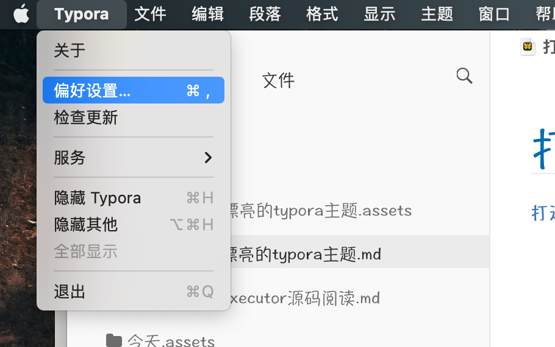
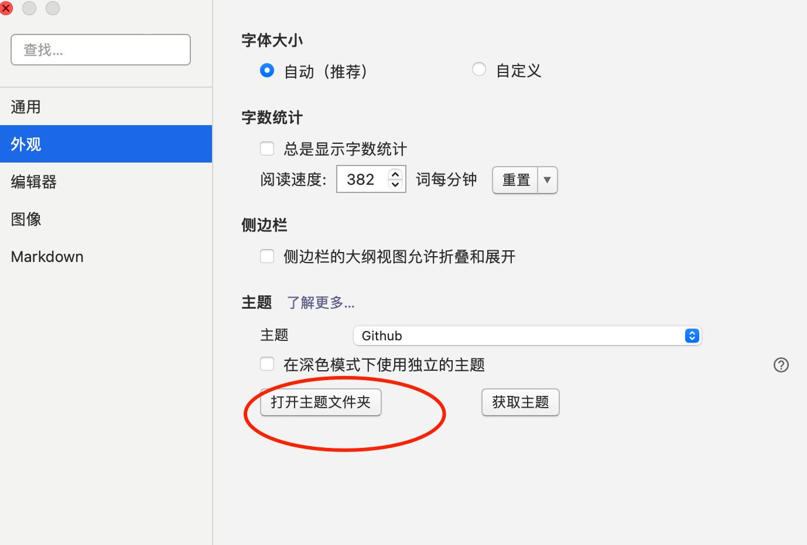
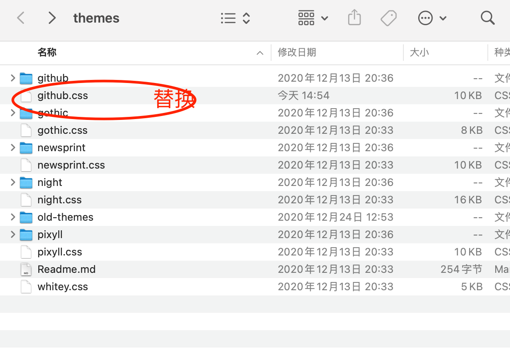
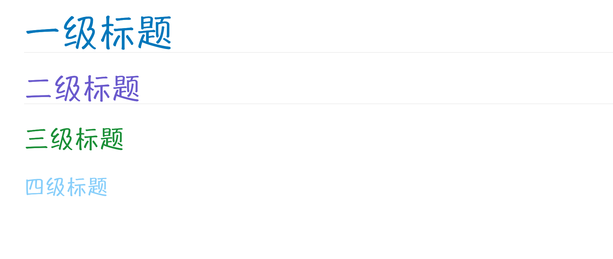
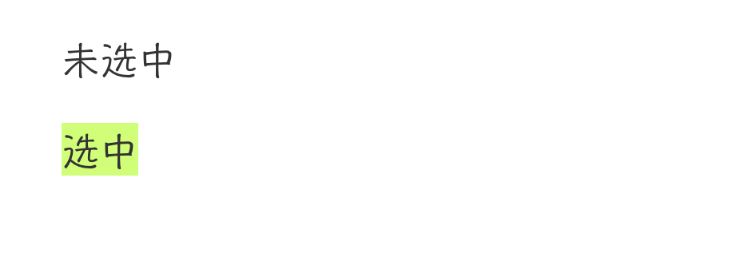
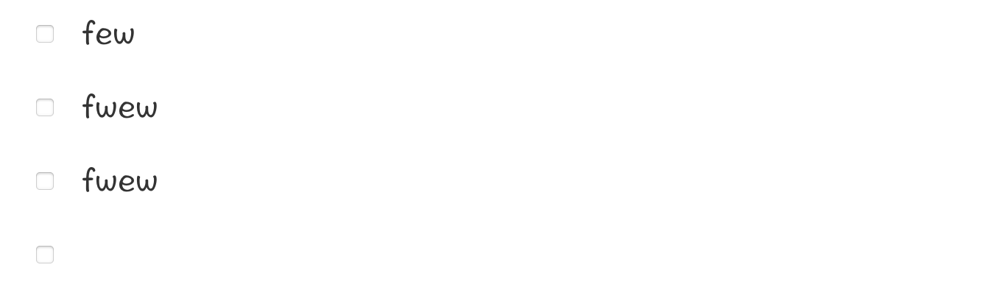

# 打造全网最漂亮的typora


## typora样式修改步骤

### 第一步打开偏好设置



### 第二步打开主题文件夹



### 用百度云盘提供github.css替换文件夹github.css



## 字体优化

> 使用手写字体，让文档看上去更好看(mac貌似自带了Hannotate SC，有需要可以提供下载链接)

```css
body {
    font-family: "Hannotate SC","Open Sans","Clear Sans", "Helvetica Neue", Helvetica, Arial, sans-serif;
    color: rgb(51, 51, 51);
    line-height: 1.6;
}
```

## 标题添加颜色

> 可通过色卡app自行搭配一套笔记搭的颜色





```css
h1 {
color: #0077bb; /* 将标题改为蓝色 */
}
h2{
color:#6A5ACD
}
h3{
color: rgb(26, 143, 55)
}
h4{
color: #87CEFA
}
h5{
color:#87CEFA
}
strong {
color:#40E0D0
}
```


## 表格优化

> 表格各行变色，宽度设置为100%（个人喜欢，可以根据个人喜好留白）,表头不换行，默认样式表头很长会自动换行很丑，普通行文字自动换行，这里设置了每行不一样的颜色，如果不喜欢花里胡哨，可以简单设置几个颜色即可，颜色同样可以在色卡app自行选择。


| 在长我也不换行行行行行行行行行行行行行行行行行行行行行行行   |      |
| ------------------------------------------------------------ | ---- |
| 太长我会自动换行行行行行行行行行行行行行行行行行行行行行行行行行行行行行行行行行行行行行 |      |
| 每行不同颜色                                                 |      |
|                                                              |      |
|                                                              |      |
|                                                              |      |
|                                                              |      |


```css
tbody tr:nth-child(even){background-color:#effaff;}
tbody tr:nth-child(odd){background-color:#fff1f6;}
tbody tr:nth-child(1){background-color:#8AE1FC;}
tbody tr:nth-child(2){background-color:#EFA7A7;}
tbody tr:nth-child(3){background-color:#FFD972;}
tbody tr:nth-child(4){background-color:#FCF5FC;}
tbody tr:nth-child(5){background-color:#F3F1EC;}
tbody tr:nth-child(6){background-color:#CCECD6;}
tbody tr:nth-child(7){background-color:#C2DDA6;}
tbody tr:nth-child(8){background-color:#c9af98;}
tbody tr:nth-child(9){background-color:#F5E5FC;}
tbody tr:nth-child(10){background-color:#ed8a63;}
table thead{
white-space:nowrap;
}
table {
width:100%;
table-layout:fixed !important;
word-break:break-word !important;
}
```


## 背景高亮，文字选中带颜色

未选中

选中



```css
/*==背景高亮==*/
mark {
    background: #ffffff;
    color: #db3f1e;
    font-weight: bold;
    border-bottom: 0px solid #ffffff;
    padding: 0.0px;
    margin: 0 0px;
}

::selection { background-color: #d1ff79; }
```


## 复选框优化

> 设置复选框文字带颜色，调整了复选框大小，此设置不一定适合所有显示器可以不调整

优化前



优化后

- [ ] 
- [ ] 你好
- [ ] fwefwfe
- [ ] fwwfewf
- [ ] fwefw

```css
 /* 修改checkbox样式 */

.task-list-item p{font-size:32px;!important;color:#1E90FF;}
.task-list-item input[type=checkbox]{
display:inline-block !important;

zoom: 140%;
}

.md-task-list-item > input {
  margin-left: -0.8em !important ;
}

.md-task-list-item > li .mathjax-block, li p {
margin: 0.0rem 0px;
}
```

